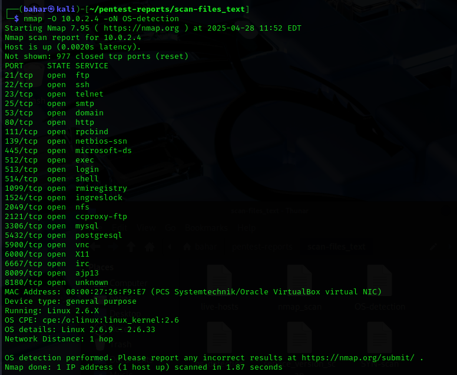

# Network Scanning and Enumeration
This repo covers the practice of discovering active hosts, open ports, services, and operating system details on a network using the Nmap and Netcat tools.

## 📋File Information
**Tools**  
Nmap   
Netcat  
Metasploitable2  

## 🔧 How to Use
You can preview the test network that will be used for scanning by uploading the files.

## You can see:
**Live Hosts**  
  
**SYN scan**  
  
**Service version**  
  
**Operating System detection**  
  
**Banner grabbing**  
  
